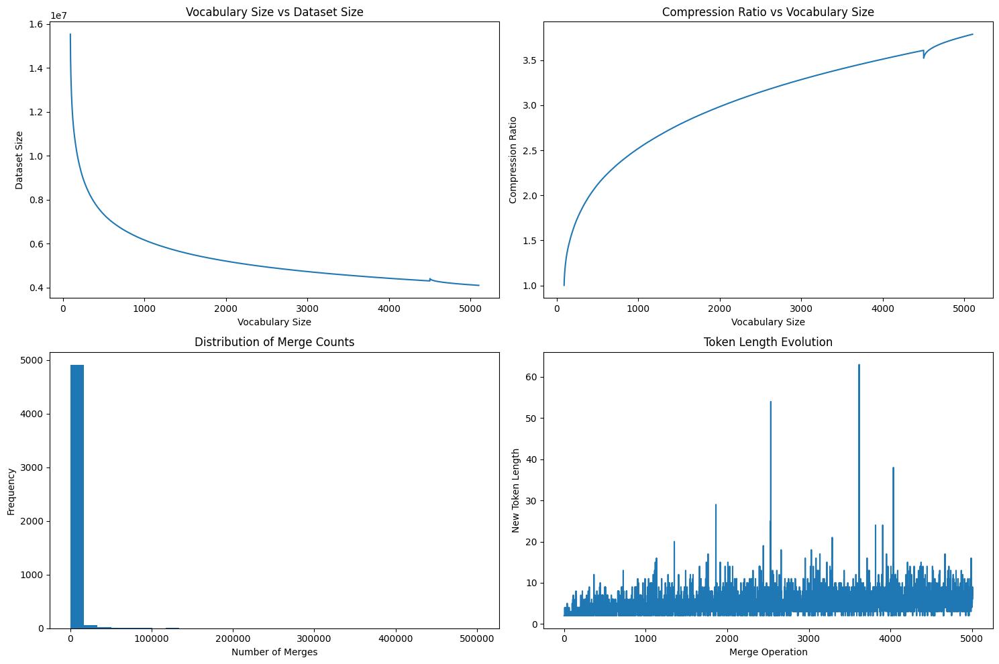

A Byte Pair Encoding (BPE) tokenizer for the Devanagari script. Trained on cleaned Wikipedia hindi articles, this tokenizer achieves a compression ratio of 3.7 a vocabulary of 5100 tokens.

## Features

- Specialized for Devanagari script
- Achieves 3.7x compression ratio
- Vocabulary size: 5100 tokens
- Handles common Hindi text patterns effectively
- Built-in text cleaning and normalization



The longest tokens in the vocabulary are:

```
Length 63: तहसील में भारत के उत्तराखण्ड राज्य के अन्तर्गत कुमाऊँ मण्डल के 
Length 54: तहसील में भारत के उत्तराखण्ड राज्य के अन्तर्गत कुमाऊँ 
Length 38: भारत के आन्ध्रप्रदेश राज्य के अन्तर्गत
```

## Usage

```python
from encoder import BytePairEncoder

encoder = BytePairEncoder.load_from_file("assets/hindi_tokenizer_5100.json")
tokenizer = GreedyBPE(encoder)

tokenizer.tokenize("नमस्ते दुनिया")
```

## Dataset Selection

Several Hindi datasets were evaluated before selecting the final training data:

1. **Hindi Wikipedia Articles** (https://www.kaggle.com/datasets/disisbig/hindi-wikipedia-articles-172k) ✅
   - 172K cleaned Hindi articles
   - Pure Devanagari script
   - Good mix of formal and common language
   - **Selected for training**

2. **CC-100 Hindi Romanized** (http://data.statmt.org/cc-100/hi_rom.txt.xz)
   - Transliterated Hindi language
   - Too noisy

3. **IITB Parallel Corpus** (https://www.cfilt.iitb.ac.in/iitb_parallel/)
   - High-quality Hindi-English translation data
   - Formal language, less representative of common usage

4. **Hindi Discourse** (https://github.com/midas-research/hindi-discourse)
   - Good variety of sentence types
   - Limited size

The Wikipedia dataset was chosen for its clean text, broad coverage of topics, and pure Devanagari script content.

## Data cleaning

Data cleaning was essential in reducing the initial vocabulary size from 1,500+ unique characters to 93 characters. `main.py` describes the steps for cleaning the data.

- Normalized excess whitespace
- Filtered out emojis
- Removed empty lines
